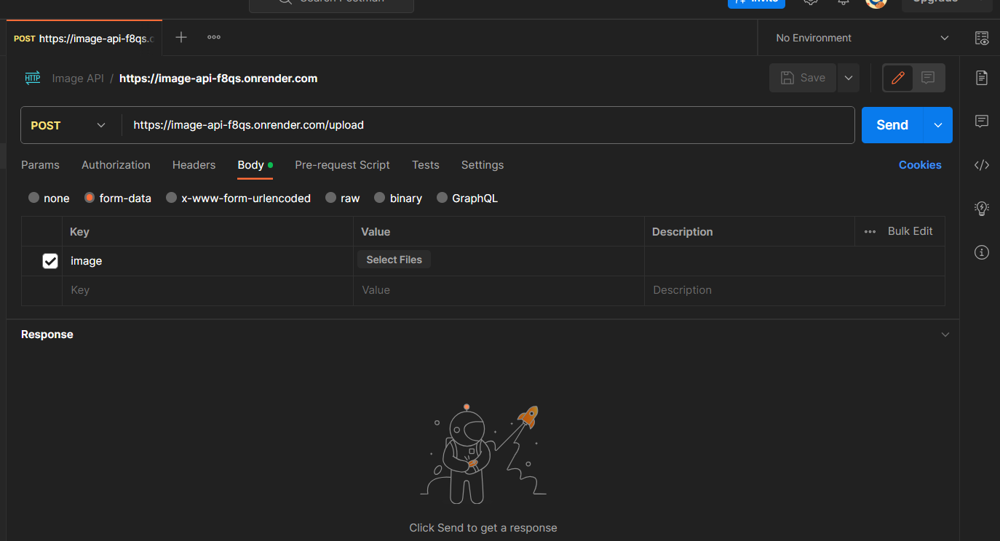
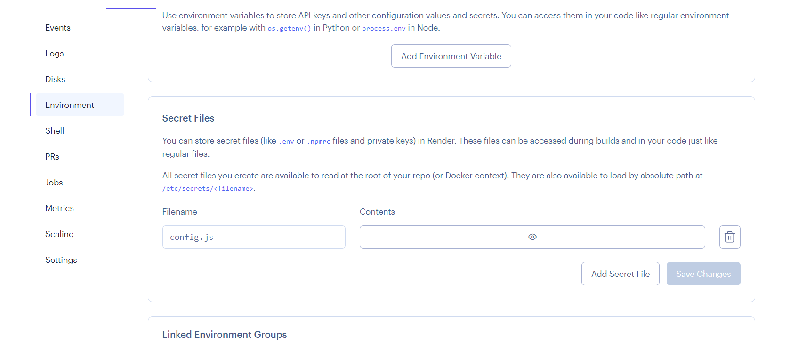

<h2>API Information</h2>

This API can add images and send them to a MongoDB database. Using the ```/image/id``` search param you can search for your images by their ID and have the image rendered infront of you. 

<!-- <br/> -->
<h6>Tech Stack:</h6>
Node.js | Express.js | MongoDB/Mongoose
<br/>
Postman

<h3>Article Link</h3>
Here is an article for more information about the source code: https://noor-ahmed.hashnode.dev/create-and-deploy-image-api

<h3>API Links</h3>

```
https://image-api-f8qs.onrender.com
```

<h3>Upload An Image</h3>

```
https://image-api-f8qs.onrender.com/upload
```
Use Postman for adding images or any other API service.
<br/>



<!-- <br/> -->
<h3>Search for an Image</h3>

```
https://image-api-f8qs.onrender.com/image/id
```

<h3>ID's to search through</h3>

```
64e76e4e53ead60703895ba5
```

```
64e76f7e6fbe37fb8474d93b
```

```
64edba179a581d5a79deec98
```

```
64edbaab9a581d5a79deec9b
```

<h3>Cool Tiktok Sound</h3>
```
664655f27ad5ac4ba5177b85
```

<h3>Install Dependencies</h3>

```
npm install
```

<h3>Run Node API</h3>
First remember to cd into your directory and then write this command:

```
nodemon app.js
```

<h3>Hosting Service:</h3>
Currently the API is being hosted using onrender which is a free hosting service: https://render.com. If you want to host it yourself or if you want to make some changes to the API then here I will discuss a few things you will need to know.

<h3>Deploy API</h3>
All of the steps for deployment can be found in this video: https://www.youtube.com/watch?v=bnCOyGaSe84&ab_channel=CodeBrah

<h3>Deploy API with hidden .env or config.js file</h3>
In order to deploy the API to onrender with a hidden .env you can follow this tutorial, go to 16:24 in the tutorial: https://www.youtube.com/watch?v=68ubggfsQlE

<br/>
<br/>
If you have a hidden config.js file or any other named file with the mongodb uri then on render.com when you go on environment, navigate to Secret Files and fill in the details for your config.js file there instead of environment variables:

<br/>
<br/>

<!-- <br /> -->
<br />

Please make sure to setup a MongoDB cluster before you use this API. Here is an informative tutorial on how you can do this: https://www.youtube.com/watch?v=s0anSjEeua8&ab_channel=TheNetNinja

<!-- <br /> -->

